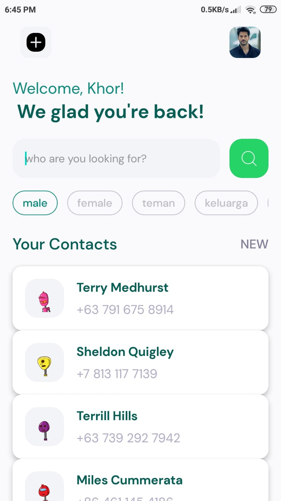

<a name="readme-top"></a>

<!-- PROJECT LOGO -->
<br />
<div align="center">

<h3 align="center">Contact App</h3>

</div>

<!-- ABOUT THE PROJECT -->

## About The Project

[![Product Name Screen Shot][product-screenshot]](https://github.com/Ikhor03/Contact-app)


This is my first mobile app project, and it was quite a challenge. I had the same deadline for another project while working on this one, making it an incredibly busy week. However, it wasn't as bad as it sounds. I never thought building a mobile app would bring me so much joy, especially when I see the results directly on my phone. This app is a simple contact application that integrates data from the [Dummyjson](https://dummyjson.com/) user API. It also features a live search function.

<p align="right">(<a href="#readme-top">back to top</a>)</p>

### Built With

- [React Native](https://reactnative.dev/)
- [Expo](https://docs.expo.dev/)

<!-- GETTING STARTED -->

## Getting Started

You can fork this repo

### Installation

1. Clone the repo
   ```sh
   git clone https://github.com/Ikhor03/Contact-app
   ```
2. Install and use the correct version of Node using [NVM](https://github.com/nvm-sh/nvm). And so you can install dependencies
   ```sh
   npm install
   ```
3. Start the development server

   ```sh
   npm start
   ```

<p align="right">(<a href="#readme-top">back to top</a>)</p>

<!-- MARKDOWN LINKS & IMAGES -->
<!-- https://www.markdownguide.org/basic-syntax/#reference-style-links -->

[product-screenshot]: ./assets/contact-ss.jpg
[React.js]: https://img.shields.io/badge/React-20232A?style=for-the-badge&logo=react&logoColor=61DAFB
[React-url]: https://reactjs.org/
